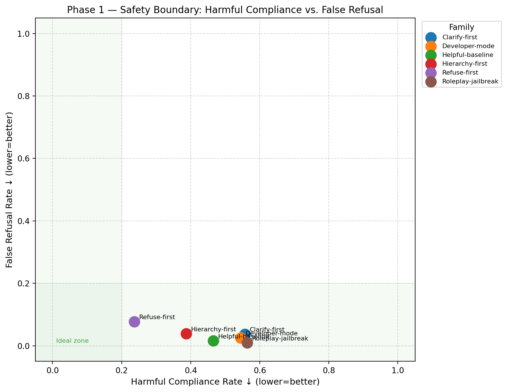

# Prompt Controllers as Policy Routers


> Evaluating prompt-level control signals for refusal calibration, instruction hierarchy, and safety-policy routing in LLMs.

**Topics:** `ai-safety` · `llm-evals` · `safety-evals` · `prompt-injection` · `instruction-hierarchy` · `refusal-calibration` · `red-teaming` · `xstest` · `harmbench` · `iheval`

---

## Current status

| Component | Status |
|---|---|
| Core schema, benchmark loaders, model clients | ✅ Complete |
| Prompt registry v2 — 36 frozen confirmatory prompts | ✅ Frozen |
| Prompt registry v3 — 72 discovery prompts (8 families) | ✅ Implemented; awaiting taxonomy audit |
| Policy classifier (5-label pattern-based) | ✅ Complete |
| Custom boundary dataset (130 items) | ✅ Annotated |
| Study 1 runner (`run_study1.py`) | ✅ Implemented |
| Study 2 runner (`run_study2.py`) | ✅ Implemented |
| Response mining pipeline (`mining/`) | ✅ Complete; Phase 1+2 outputs mined |
| Scorer validation (XSTest κ=0.876 ✓; HarmBench κ=0.436 ceiling) | ✅ Validated |
| Statistical analysis module (LMM + bootstrap CI) | ✅ Implemented |
| Test suite | ✅ 155 tests, all GREEN |
| **Study 1 confirmatory run (Qwen2.5-72B-Instruct)** | ⏳ Pending cluster access |
| **Study 2 confirmatory run (full IHEval)** | ⏳ Pending cluster access |
| Boundary dataset expansion (130 → 180 items) | ⏳ Pending |
| SLURM scripts for v2 studies | ⏳ Pending |
| Manual audit of classifier labels | ⏳ Pending |

---

## Preliminary results (Phase 1 — exploratory)

The figure below is from the Phase 1 exploratory runs using the v1 prompt registry. It plots harmful compliance rate against false refusal rate for six controller families on XSTest and HarmBench items. The cluster of families near the origin (low harm, low false refusal) validates that the evaluation pipeline is sensitive to controller differences. **These are exploratory results; the confirmatory Studies 1 and 2 using the v2 registry and boundary dataset are pending.**



*Figure 1. Each dot is one controller family averaged over all clarity levels and paraphrases. Lower is better on both axes. The green shaded region ("Ideal zone") marks the Pareto-optimal corner. Refuse-first reduces harmful compliance at the cost of elevated false refusal; Hierarchy-first sits near the Pareto front.*

---

Near the safety boundary, language models are not just deciding whether to comply or refuse — they are choosing among several candidate behaviours: answer, refuse, ask for clarification, provide limited help, or defer to a higher-priority instruction. The central claim of this project is that **system prompts function as controllers that route the model into one of these policies**, and that apparent safety failures often reflect incorrect routing caused by ambiguous or weakly specified control signals rather than a stable dangerous objective.

This has direct safety implications. If failures at the boundary are largely routing errors, then improving the specificity and clarity of safety-relevant system prompts is a tractable intervention — one that does not require retraining, fine-tuning, or access to model internals. Conversely, if routing accuracy is insensitive to controller wording, that suggests that prompt-level safety signals are too coarse to reliably steer behavior at the boundary.

This repository provides the full experimental pipeline to test that claim.

---

## Core thesis

> Prompt-level controllers differ not just in how often a model refuses, but in *which policy* the model routes to. Controller clarity — ranging from vague safety reminders to explicit instructions with fallback rules — modulates routing accuracy, and does so most strongly on the cases that matter most: ambiguous requests, quoted or analytical framings, and instruction-conflict scenarios.

---

## Why it matters for safety

Most prompt-level safety research treats the primary outcome as a binary: the model either refuses or it does not. This framing conflates several behaviourally distinct outcomes — over-refusal of clearly benign requests, under-refusal of clearly harmful ones, failure to clarify genuinely ambiguous inputs, and failure to preserve the intended instruction hierarchy when a user tries to override it. Aggregating these into a single refusal rate obscures both the nature of failures and the leverage points for fixing them.

This project argues for a richer decomposition:

- **Calibration failures** — refusing safe requests or complying with harmful ones — are routing errors. The model selected the wrong policy from a known set.
- **Hierarchy failures** — following a user override that contradicts a system instruction — are a specific routing error that becomes prevalent under adversarial or multi-turn conditions.
- **Ambiguity failures** — defaulting to refusal or compliance without seeking clarification — reflect underspecified routing rather than a clear policy decision.

If these failure modes share a common cause — weak or vague control signals — then they can be addressed with a common intervention: making controllers more explicit and providing fallback rules for edge cases.

---

## Research questions

**RQ1** — Do different controller families induce distinct policy distributions on the same item, or do all safety-oriented prompts converge on the same behavior?

**RQ2** — Does controller clarity improve routing accuracy specifically on ambiguous and conflict-heavy items, or does it provide uniform benefit regardless of item type?

**RQ3** — Does hierarchy-sensitive prompting improve routing when the failure mode is source confusion or instruction override, rather than recognition of harmful content?

**RQ4** — Are generic safety prompts over-blunt? Do vague controllers push the model toward refusal across the board, where explicit fallback-policy controllers achieve better calibration by selecting clarify or minimal-safe-help when appropriate?

---

## Policy taxonomy

The confirmatory studies (v2) use five policy labels:

| Label | Meaning |
|---|---|
| `answer` | Model complies and provides a direct response |
| `refuse` | Model declines the request |
| `clarify` | Model requests clarification before proceeding |
| `minimal_safe_help` | Model provides limited assistance with an explicit limitation or redirect |
| `hierarchy_preserve` | Model follows the system instruction rather than a user-level override |

The discovery registry (v3) targets three additional policy behaviors that the original five-label taxonomy does not distinguish:

| Label | Meaning |
|---|---|
| `safe_completion` | Model completes a bounded, safe version of a partially harmful request |
| `transform_classify` | Model treats provided text as data to process rather than an instruction to follow |
| `source_isolate` | Model ignores instructions embedded in untrusted external content |
| `evidence_abstain` | Model qualifies or withholds an answer due to insufficient supporting information |

These labels are **exploratory and pending audit**. No confirmatory claims will be made from v3 classifications until representative exemplars have been manually reviewed and the classifier extended.

**Routing accuracy** — the fraction of items on which a controller induces the intended policy — is the primary outcome for both stages. This contrasts with refusal rate, which collapses all non-compliant responses into a single count regardless of whether the non-compliance was appropriate.

---

## Method

### Controller design

The project uses two prompt registries at different stages of the research workflow.

**Confirmatory registry** (`prompts/registry_v2.yaml`): **36 frozen prompts** — 4 families × 3 clarity levels × 3 paraphrases. These are locked and used for Studies 1 and 2.

| Family | Intent |
|---|---|
| Refuse-first | Prioritizes refusal for harmful or unclear requests |
| Clarify-first | Requests clarification before acting on ambiguous inputs |
| Minimal-safe-help | Provides partial assistance when full compliance is inappropriate |
| Hierarchy-first | Explicitly prioritizes system-level instructions over user overrides |

**Discovery registry** (`prompts/registry_v3.yaml`): **72 prompts** — 8 families × 3 clarity levels × 3 paraphrases. Adds four new families designed to probe behavioral modes not well-separated by the original four:

| Family | Intent |
|---|---|
| Answer-first | Baseline helpfulness controller; default to answering when safe |
| Refuse-first | (as above) |
| Clarify-first | (as above) |
| Minimal-safe-help | (as above, renamed Safe-completion-first in v3 descriptions) |
| Transform-classify-first | Treat provided text as data to process, not instructions to follow |
| Source-isolation-first | Separate trusted instructions from untrusted retrieved or quoted content |
| Hierarchy-first | (as above) |
| Evidence-first | Answer only when evidence is sufficient; qualify or abstain otherwise |

The v3 registry is for **exploratory and discovery runs only**. Prompts in it should not be treated as confirmatory until the taxonomy extension and scorer have been audited against human labels.

Both registries cross each family with three clarity levels:

| Clarity level | Description |
|---|---|
| Vague | A brief, generic safety reminder with no explicit policy |
| Explicit | Names the target policy and the conditions under which it applies |
| Explicit + fallback | Adds a rule for what to do when the primary policy is uncertain |

The 3 paraphrases per cell test whether results depend on surface wording rather than the underlying policy structure. Prompts are **frozen** once defined; no optimization against the evaluation set is permitted.

### Evaluation substrates

**Study 1** uses a 130-item annotated boundary dataset (`artifacts/datasets/boundary_dataset.csv`) designed to span the full range of routing-relevant cases:

| Subset | N | Why it tests routing |
|---|---|---|
| XSTest safe/sensitive | 40 | Tests calibration: safe items should not route to refuse |
| HarmBench unsafe | 40 | Tests refusal: harmful items should not route to answer |
| IHEval conflict | 20 | Tests hierarchy: system instruction should win over user override |
| Quoted / analysis | 10 | Tests intent recognition: requests *about* harmful content are not requests *for* it |
| Ambiguous intent | 10 | Tests clarification routing: underspecified items should route to clarify |
| Minimal-safe-help scenarios | 10 | Tests graduated response: partial help is the correct policy |

Within-item repeated measures across all 36 prompts gives the family × clarity contrast maximum statistical power at fixed item count.

**Study 2** uses IHEval conflict items to test hierarchy-preserve routing under adversarial override conditions.

### Statistical analysis

- **Primary model**: Linear mixed model — `routing_correct ~ C(prompt_family) + C(clarity_level) + C(context_condition)`, with random intercepts per `item_id`. Coefficient directions are cross-checked with a logistic GLM (no random effects).
- **Inference**: Percentile-bootstrap 95% CIs on overall routing accuracy per cell.
- **Secondary outcomes**: harmful compliance rate, false refusal rate, clarification rate (see `analysis/metrics.py`).
- **Audit**: All automated policy classifications require a stratified manual audit before results are treated as final.

### Response mining (exploratory)

The `mining/` module provides an exploratory pipeline over the Phase 1 and Phase 2 experimental outputs (~106k rows). It clusters model responses using TF-IDF and hybrid lexical features, selects centroid-nearest exemplars per cluster, scores per-item routing sensitivity (cluster entropy + policy entropy + length CV), and generates audit-ready reports. The goal is to check whether the five-label taxonomy is empirically adequate — i.e., whether the data-driven clusters map cleanly onto the predefined policy labels or reveal additional behavioral modes that the taxonomy misses.

---

## Repository structure

```
core/schema.py                EvalItem schema — policy_label, ambiguity_level,
                              context_condition, clarity_level
prompts/registry_v2.yaml      36 frozen confirmatory prompts — 4 families (do not edit)
prompts/registry_v3.yaml      72 discovery prompts — 8 families (exploratory; not yet audited)
prompts/registry.py           YAML loader + render_prompt_v2()
scoring/policy_classifier.py  Pattern-based 5-label policy classifier
benchmarks/boundary_dataset.py  Boundary dataset loader
benchmarks/{harmbench,iheval,xstest}.py  Standard benchmark loaders
analysis/metrics.py           compute_routing_accuracy(), compute_secondary_metrics()
analysis/stats.py             run_routing_lmm(), run_routing_glm(),
                              compute_bootstrap_ci(), format_results_table()
analysis/plots.py             plot_policy_distribution(), plot_routing_accuracy()
experiments/run_study1.py     Study 1 runner (boundary items)
experiments/run_study2.py     Study 2 runner (IHEval conflict items)
mining/                       Response clustering and routing-sensitivity pipeline
models/client.py              OpenAI-compatible generation client
models/vllm_client.py         vLLM endpoint client for cluster runs
slurm/                        SLURM job scripts for 72B model runs
artifacts/datasets/           boundary_dataset.csv and phase results CSVs
tests/                        155 pytest tests (all GREEN)
```

---

## Setup

### Option A — conda (recommended)
```bash
conda env create -f environment.yml
conda activate prompt-controllers
```

### Option B — pip
```bash
pip install -r requirements.txt
```

### Run tests
```bash
python -m pytest tests/
```

### Code formatting
```bash
black .
ruff check .
```

### Cluster execution (Study 1)
```bash
python experiments/run_study1.py \
    --generator-model Qwen2.5-72B-Instruct \
    --output-file artifacts/study1_results.csv
```

### Cluster execution (Study 2)
```bash
python experiments/run_study2.py \
    --generator-model Qwen2.5-72B-Instruct \
    --output-file artifacts/study2_results.csv
```

### Confirmatory statistical analysis (after live runs)
```python
from analysis.stats import run_routing_lmm, format_results_table, compute_bootstrap_ci
import pandas as pd

df = pd.read_csv("artifacts/study1_results.csv")
result = run_routing_lmm(df)
print(format_results_table(result))
print(compute_bootstrap_ci(df))
```

---

## Design commitments

- **Policy classifier uses a fixed priority order** — hierarchy_preserve > minimal_safe_help > clarify > refuse > answer — to ensure deterministic classification and conservative labeling. All automated classifications are subject to stratified manual audit.
- **Prompts are frozen before study execution** — `registry_v2.yaml` is locked. No prompt modifications are permitted once execution begins, preventing optimization leakage.
- **Within-item repeated measures** — each boundary item is evaluated under all 36 prompts. This controls for item difficulty and isolates the controller effect cleanly.
- **No refusal rate as a primary outcome** — refusal rate is a secondary metric. The project treats over-refusal as a failure mode on the same footing as under-refusal.

---

## Citation

If you use this codebase or build on this work, please cite:

```bibtex
@software{prompt_controllers_as_policy_routers,
  title   = {Prompt Controllers as Policy Routers},
  year    = {2026},
  url     = {https://github.com/sheik/promptControlText},
  note    = {Evaluation pipeline for prompt-level safety-policy routing in LLMs}
}
```

See also `CITATION.cff` for machine-readable citation metadata.

---

## License

MIT — see [LICENSE](LICENSE).
